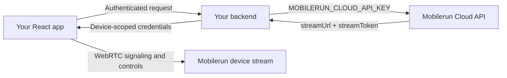

Use [`@mobilerun/react`](https://www.npmjs.com/package/@mobilerun/react) to embed a
live Mobilerun cloud device in your own React interface. The package provides the
video stream, touch and keyboard input, Android navigation controls, connection
status, and automatic reconnection. You provide the surrounding UI and branding.

This guide uses Next.js for the server endpoint, but the same security boundary
applies to any React stack.

## Before you start

You need:

- React 18 or 19
- A [Mobilerun cloud API key](https://docs.mobilerun.ai/api-keys)
- A ready [Mobilerun cloud device](https://docs.mobilerun.ai/cloud/quickstart) and
  its device ID
- A backend that can authenticate users of your application

<Warning>
Never expose `MOBILERUN_CLOUD_API_KEY` in browser code. It grants access to your
Mobilerun account. Your backend must retrieve the stream credentials and return
them only to a user who is authorized to access that device.
</Warning>

## How the integration works



The account API key remains on your server. The browser receives a stream URL and
a device-scoped token, then connects directly to the Mobilerun stream.

The stream token is sensitive. It remains valid until it is rotated or the device
is terminated; it is not a short-lived browser session token. Do not log it, put
it in analytics, persist it in local storage, or include it in error reports.

## 1. Install the packages

```bash
npm install @mobilerun/react @mobilerun/sdk react react-dom
```

Import the packaged stylesheet once in your application's root layout:

```tsx app/layout.tsx
import '@mobilerun/react/styles.css';
import './globals.css';

export default function RootLayout({
  children,
}: Readonly<{ children: React.ReactNode }>) {
  return (
    <html lang="en">
      <body>{children}</body>
    </html>
  );
}
```

The stylesheet does not include a CSS reset and does not require Tailwind CSS.

## 2. Keep the Mobilerun API key on the server

Add the key to your server environment:

```bash .env.local
MOBILERUN_CLOUD_API_KEY=dr_sk_...
```

Do not prefix the variable with `NEXT_PUBLIC_`, `VITE_`, or any other
browser-exposed prefix.

Create a backend endpoint that retrieves only the fields required by the stream:

```ts app/api/device-stream/[deviceId]/route.ts
import Mobilerun from '@mobilerun/sdk';
import { type NextRequest, NextResponse } from 'next/server';

// Replace these with your application's authentication and authorization layer.
import { canAccessDevice, getCurrentUser } from '@/server/auth';

const apiKey = process.env.MOBILERUN_CLOUD_API_KEY;

if (!apiKey) {
  throw new Error('MOBILERUN_CLOUD_API_KEY is not configured');
}

const mobilerun = new Mobilerun({ apiKey });

export async function GET(
  request: NextRequest,
  context: { params: Promise<{ deviceId: string }> },
) {
  const user = await getCurrentUser(request);
  if (!user) {
    return NextResponse.json({ error: 'unauthorized' }, { status: 401 });
  }

  const { deviceId } = await context.params;
  if (!(await canAccessDevice(user.id, deviceId))) {
    return NextResponse.json({ error: 'forbidden' }, { status: 403 });
  }

  try {
    const device = await mobilerun.devices.retrieve(deviceId);

    return NextResponse.json(
      {
        streamUrl: device.streamUrl || null,
        streamToken: device.streamToken || null,
        state: device.state,
      },
      {
        headers: {
          'Cache-Control': 'no-store',
        },
      },
    );
  } catch (error) {
    const status =
      error instanceof Mobilerun.APIError && error.status === 404 ? 404 : 502;

    return NextResponse.json(
      { error: status === 404 ? 'device_not_found' : 'stream_unavailable' },
      { status },
    );
  }
}
```

<Note>
The Mobilerun API checks that the API key can access the device. Your endpoint
must additionally check that the signed-in user of your application is allowed
to use that device. A device ID alone is not authorization.
</Note>

## 3. Render the stream

The device may still be starting when the page opens. The following hook polls
until stream credentials are available and can also refresh them after a
connection self-heal:

```tsx components/white-label-device.tsx
'use client';

import {
  DeviceStream,
  NavigationBar,
  type RemoteControlHandle,
} from '@mobilerun/react';
import { useCallback, useEffect, useRef, useState } from 'react';

interface StreamCredentials {
  streamUrl: string | null;
  streamToken: string | null;
  state: string;
}

function useStreamCredentials(deviceId: string) {
  const [credentials, setCredentials] = useState<StreamCredentials>();
  const [error, setError] = useState<string>();
  const [refreshKey, setRefreshKey] = useState(0);

  const refresh = useCallback(() => {
    setRefreshKey((value) => value + 1);
  }, []);

  useEffect(() => {
    let cancelled = false;
    let timer: ReturnType<typeof setTimeout> | undefined;

    async function load() {
      try {
        const response = await fetch(`/api/device-stream/${deviceId}`, {
          cache: 'no-store',
        });

        if (!response.ok) {
          throw new Error(`Unable to load stream (${response.status})`);
        }

        const next = (await response.json()) as StreamCredentials;
        if (cancelled) return;

        setCredentials(next);
        setError(undefined);

        if (!next.streamUrl) {
          timer = setTimeout(load, 3_000);
        }
      } catch (cause) {
        if (!cancelled) {
          setError(cause instanceof Error ? cause.message : 'Unable to load stream');
        }
      }
    }

    void load();

    return () => {
      cancelled = true;
      if (timer) clearTimeout(timer);
    };
  }, [deviceId, refreshKey]);

  return { credentials, error, refresh };
}

export function WhiteLabelDevice({ deviceId }: { deviceId: string }) {
  const stream = useRef<RemoteControlHandle>(null);
  const { credentials, error, refresh } = useStreamCredentials(deviceId);

  if (error) {
    return (
      <div className="device-error">
        <p>{error}</p>
        <button type="button" onClick={refresh}>
          Try again
        </button>
      </div>
    );
  }

  return (
    <section className="device-shell" aria-label="Remote device">
      <div className="device-screen">
        <DeviceStream
          ref={stream}
          streamUrl={credentials?.streamUrl ?? undefined}
          streamToken={credentials?.streamToken ?? undefined}
          hasControl
          muted
          placeholderLabel={credentials?.state ?? 'loading'}
          onStreamHealed={refresh}
        />
      </div>

      <NavigationBar
        className="device-navigation"
        onAction={(action) => stream.current?.sendSystemKey(action)}
      />
    </section>
  );
}
```

`hasControl` determines whether pointer and keyboard interaction reaches the
device. Set it to `false` for a view-only stream.

The stream starts muted so browser autoplay policies do not block it. Only unmute
in response to a user action.

## 4. Apply your own branding

The component reads CSS variables from an ancestor. Override them and style the
surrounding shell to match your product:

```css app/globals.css
.device-shell {
  --background: #09090b;
  --foreground: #fafafa;
  --card: #18181b;
  --muted: #27272a;
  --muted-foreground: #a1a1aa;
  --border: #3f3f46;
  --primary: #7c3aed;

  display: flex;
  width: min(100%, 390px);
  aspect-ratio: 9 / 19.5;
  flex-direction: column;
  overflow: hidden;
  border: 1px solid var(--border);
  border-radius: 32px;
  background: var(--background);
  box-shadow: 0 24px 60px rgb(0 0 0 / 20%);
}

.device-screen {
  min-height: 0;
  flex: 1;
}

.device-navigation {
  flex: none;
}
```

No Mobilerun logo or application chrome is added by `DeviceStream`. Your
application owns the device frame, labels, buttons, loading states, and surrounding
experience.

## Controls and lower-level actions

`DeviceStream` exposes a `RemoteControlHandle` through its ref:

```tsx
stream.current?.sendSystemKey('HOME');
stream.current?.openUrl('https://example.com');

const screenshot = await stream.current?.screenshot();
```

Available Android system keys are `BACK`, `HOME`, and `RECENT`. The package also
exports lower-level keyboard and scrcpy helpers for custom control surfaces.

## Connection lifecycle

Use the component callbacks to integrate the stream with your UI:

```tsx
<DeviceStream
  streamUrl={credentials.streamUrl ?? undefined}
  streamToken={credentials.streamToken ?? undefined}
  hasControl={canControl}
  onHasControlChange={setCanControl}
  onConnectionStateChange={(connected) => setConnected(connected)}
  onStreamHealed={refreshCredentials}
/>
```

- `onConnectionStateChange` reports WebRTC connection changes.
- `onStreamHealed` fires when the component remounts its connection after a stable
  disconnect. Retrieve the current credentials again when it fires.
- `onPeerConnectionChange` exposes the underlying `RTCPeerConnection` for advanced
  diagnostics such as `getStats()`.

## Observability

Instrument the credential endpoint with your existing OpenTelemetry setup. Useful
span attributes include the Mobilerun device ID, the resulting device state, and
the upstream status code. Never attach the stream URL, stream token, or account API
key to a span.

For product analytics, connection callbacks are a natural place to emit events:

```tsx
onConnectionStateChange={(connected) => {
  posthog.capture(
    connected ? 'device_stream_connected' : 'device_stream_disconnected',
    { device_id: deviceId },
  );
}}
```

Avoid sending connection events on every WebRTC state transition if your analytics
tool bills per event. Track the user-visible connected/disconnected transition and
do not include credentials.

## Production checklist

- The Mobilerun account key exists only in server-side configuration.
- The credential endpoint requires an authenticated application session.
- The current user is authorized for the requested device.
- Credential responses use `Cache-Control: no-store`.
- Stream URLs and tokens are excluded from logs, traces, analytics, and error
  reporting.
- The UI handles device startup, API errors, disconnects, and reconnects.
- Interactive control is enabled only for users who should be able to operate the
  device.
- Stream credentials are discarded when the view unmounts or the user signs out.

## Troubleshooting

<AccordionGroup>
  <Accordion title="The component stays on loading">
    Retrieve the device with `mobilerun.devices.retrieve(deviceId)` on the server
    and inspect its `state`. A device that is still provisioning may not have a
    `streamUrl` yet. Continue polling until the URL is present or show the terminal
    device error to the user.
  </Accordion>

  <Accordion title="The browser returns 401 or 403">
    A `401` from your credential endpoint means the application session is missing.
    A `403` means your application-level device authorization rejected the user.
    Keep these checks separate from the Mobilerun API key so access failures are
    easy to diagnose.
  </Accordion>

  <Accordion title="Video works but controls do not">
    Confirm that `hasControl` is `true`, the stream has focus, and no parent overlay
    is intercepting pointer events. Keyboard input also requires the stream element
    to be focused.
  </Accordion>

  <Accordion title="The stream reconnects repeatedly">
    Use `onPeerConnectionChange` and `RTCPeerConnection.getStats()` to inspect the
    connection. Also make sure `onStreamHealed` retrieves current credentials
    instead of reusing a token from an earlier device assignment.
  </Accordion>

  <Accordion title="Audio does not start">
    Browsers block unmuted autoplay. Keep `muted` enabled initially and change it
    only from a click or another explicit user gesture.
  </Accordion>
</AccordionGroup>

For the component source and local playground, see the
[`@mobilerun/react` repository](https://github.com/droidrun/mobilerun-react).
